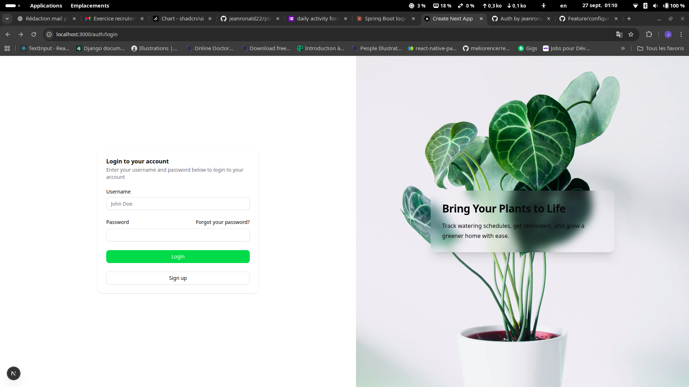
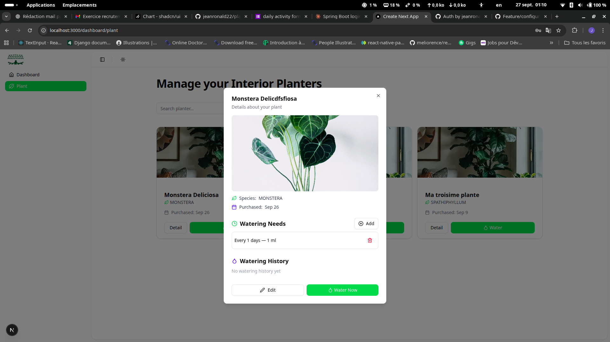
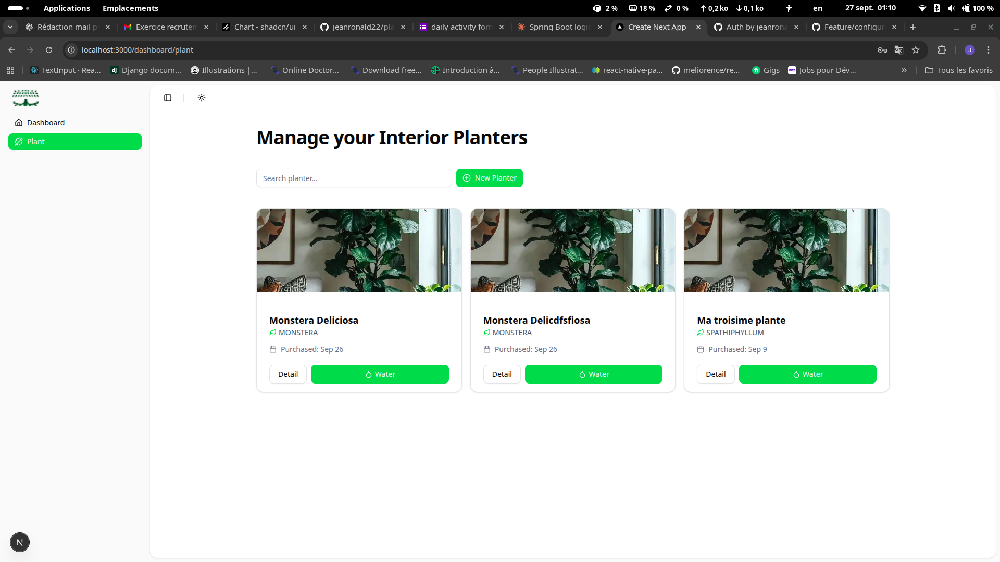
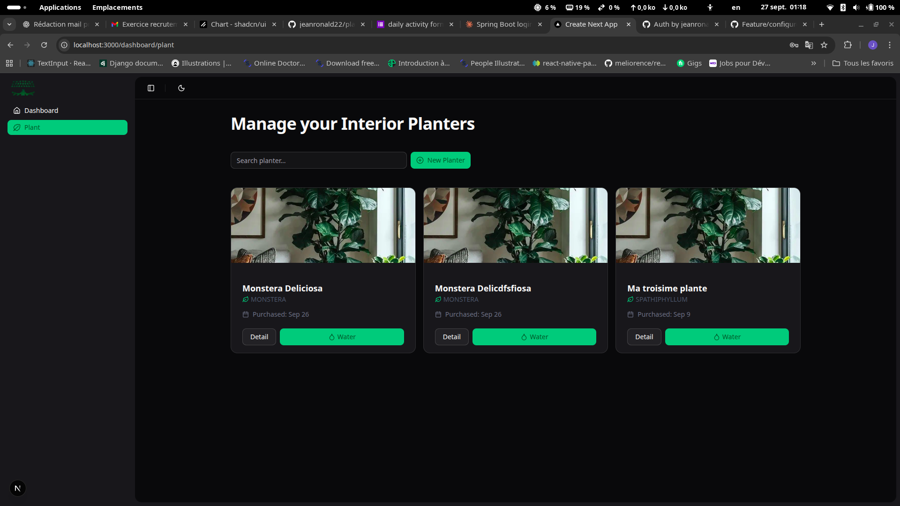

# Plant Manager - Frontend

Plant Manager est une application web développée avec **Next.js**, **React** et la bibliothèque **Shadcn UI**, permettant de gérer vos plantes d’intérieur : suivi des arrosages, ajout de nouvelles plantes, visualisation des besoins en eau et historique d’arrosage.

---

## Fonctionnalités

-   Ajouter, modifier et supprimer des plantes.
-   Visualiser les informations détaillées de chaque plante dans des modales.
-   Gérer les besoins en arrosage (`WateringNeed`) et l’historique d’arrosage (`WateringHistory`).
-   Rechercher et filtrer vos plantes par nom.
-   Affichage de statistiques et graphiques pour suivre l’entretien des plantes.
-   Interface moderne et responsive grâce à Shadcn UI.

---

## Technologies

-   **Next.js** (v15.x) – Framework React avec SSR et routeur intégré
-   **React 18** – Bibliothèque UI
-   **Shadcn UI** – Composants UI stylés et réactifs
-   **Zustand** – Gestion d’état globale
-   **Axios** – Communication avec l’API backend
-   **Tailwind CSS** – Styles utilitaires
-   **TypeScript** – Typage strict

---

## Démonstration visuelle

### Login

### Detail Plant

### Liste des plantes

